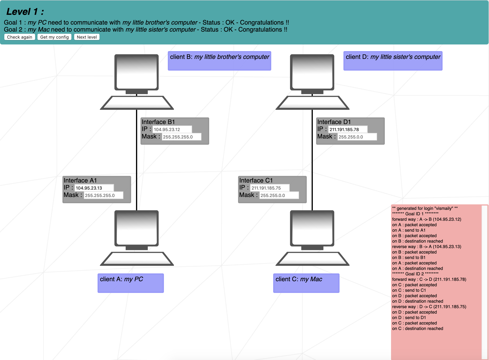

# NetPractice
## Solutions
#### Level 1
For two or more computers to communicate, they need to be on the same network (i.e. their network addresses need to be the same). Otherwise, if their network addresses differ, a router will be needed. 
##### Goal 1
Here for Goal 1 there isn't a router and the computers are connected to each other directly.
In addition, we know the ip address and network mask of B client, so we can easily calculate its network address, which will be equal to __104.95.23.0__:
```sh
IP Address:     104.95.23.12        |   01101000.01011111.00010111 .00001100
Net-mask:       255.255.255.0 = 24  |   11111111.11111111.11111111 .00000000
                                        & (Bitwise and)
Network:        104.95.23.0/24      |   01101000.01011111.00010111 .00000000
```
This means that client A must also have the same network address: __104.95.23.0__. 
In this exercise we are already given the network mask of A client __255.255.255.0__.
This network mask shows that in this network we can have `2^8-2=254` hosts (computers).
Where the smallest will have the following address:
```
HostMin:        0.0.0.1             |   00000000.00000000.00000000 .00000001
```
and the biggest:
```sh
HostMax:        0.0.0.254           |   00000000.00000000.00000000 .11111110
```
The B client's host number is 12, so we can choose any host from of the hosts rang except 12: For example I choose 13 and A client host will be:
```sh
A Client Host Number: 0.0.0.13      |   00000000.00000000.00000000 .00001101
```
By combining network address with host number, we will get the ip address of client A, which will be
```sh
Network:        104.95.23.0/24      |   01101000.01011111.00010111 .00000000
Host Number:    0.0.0.13            |   00000000.00000000.00000000 .00001101
                                        | (bitwise or)
IP Address:     104.95.23.13        |   01101000.01011111.00010111 .00001101
```
So __104.95.23.13__ is one of the correct answers.
Summing up, we can say that correct answers range is __(104.95.23.1 - 104.95.23.254)__, except 104.95.23.12.

