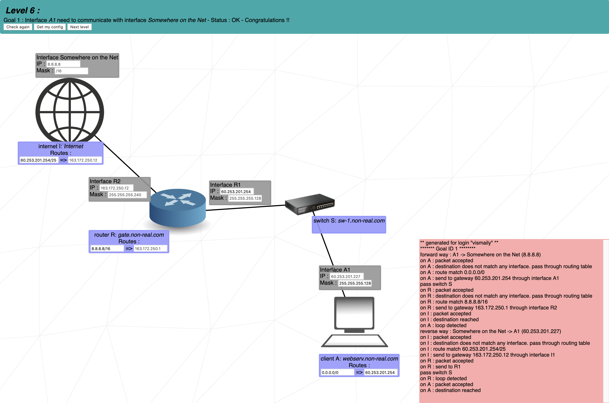

# NetPractice
## Solutions
### Level 1
For two or more computers to communicate, they need to be in the same network (i.e. their network addresses need to be the same). Otherwise, if their network addresses differ, a router will be needed.
#### Goal 1
Here, for Goal 1 there isn't a router and the computers are connected to each other directly.
In addition, we know the ip address and network mask of client B so we can easily calculate its network address, which will be equal to __104.95.23.0__:
```sh
IP Address:     104.95.23.12        |   01101000.01011111.00010111.00001100
Net-mask:       255.255.255.0 = 24  |   11111111.11111111.11111111.|00000000
                                        & (Bitwise and)
Network:        104.95.23.0/24      |   01101000.01011111.00010111.|00000000
```
This means that client A must also have the same network address: __104.95.23.0__. 
Network mask __255.255.255.0__ shows that in this network we can have `2^8 - 2 = 254` hosts (computers).
Where the smallest one will have the following address:
```
HostMin:        104.95.23.1         |	01101000.01011111.00010111.00000001
```
and the biggest:
```sh
HostMax:        104.95.23.254       |	01101000.01011111.00010111.11111110
```
The client B's IP address is 104.95.23.12, so we can choose any IP from the hosts' range except for 12. For example, if I choose 13 then client A's IP address will be:
```
Client A's Host: 104.95.23.13       |   01101000.01011111.00010111.00001101
```
So __104.95.23.13__ is one of the correct answers.<br>
Summing up, we can say that correct answers' range is __(104.95.23.1 - 104.95.23.254)__, except for 104.95.23.12.
#### Goal 2
This is the same as for Goal 1.
From Client C we get Network address which is __211.191.0.0__:
```sh
IP Address:     211.191.185.75      |   11010011.10111111.10111001.01001011
Net-mask:       255.255.0.0 = 16    |   11111111.11111111.|00000000.00000000
                                        & (Bitwise and)
Network:        211.191.0.0/16      |   11010011.10111111.|00000000.00000000
```
Client D has 255.255.0.0 Network Mask which means that this network can have `2^16 - 2 = 65,534` hosts.
Where the smallest one will have the following address:
```
HostMin:        211.191.0.1         |   011010011.10111111 .00000000.00000001
```
and the biggest:
```sh
HostMax:        211.191.255.254     |   11010011.10111111 .11111111.11111110
```
The client C’s IP address is 211.191.185.75, so we can choose any IP from the hosts’ range except for that. For example, if I choose 185.78 then client D’s IP address will be:
```
Client D's IP:  211.191.185.78      |   11010011.10111111.10111001.01001110
```
So __211.191.185.78__ is one of the correct answers.
Summing up, we can say that correct answers' range is __(211.191.0.1 - 211.191.255.254)__, except for 211.191.185.75.


___
### Level 2
#### Goal 2
Here, our two computers have the same Network mask (255.255.255.252 and /30 are identical):
```sh
Network mask: 255.255.255.252 = 30  |   11111111.11111111.11111111.111111|00
```
The hosts' count will be `2^2 - 2 = 2`.<br>
For communication between two computers we need to choose any network address and calculate their IP addresses with help of our Network mask.<br>
We can choose any network address except for reserved addresses which lists you can see [__here__](https://en.wikipedia.org/wiki/Reserved_IP_addresses).
For example you can't use 127.0.0.1 because it is reserved.<br>
Here I choose __128.0.0.160__ Network address:
```sh
Network:        128.0.0.160/30      |   10000000.00000000.00000000.101000|00
```
Now we need to combine our network address with different hosts numbers from our hosts range to get IP addresses for our computers.<br>
Because, our network has only two hosts, we can calculate only two IP addresses, which will be:<br>
Host 1:
```sh
Network:        128.0.0.160/30      |   10000000.00000000.00000000.101000|00
Host Number:    0.0.0.1             |   00000000.00000000.00000000.000000|01
                                        | (Bitwise or)
IP Address:     128.0.0.161         |   10000000.00000000.00000000.10100001
```
Host 2:
```sh
Network:        128.0.0.160/30      |   10000000.00000000.00000000.101000|00
Host Number:    0.0.0.2             |   00000000.00000000.00000000.000000|10
                                        | (Bitwise or)
IP Address:     128.0.0.162         |   10000000.00000000.00000000.10100010
```
Our IP addresses in these network are __128.0.0.161__ and __128.0.0.162__. Now we can use these addresses for our computers.<br>


___
### Level 6

___
### Level 8
On the level 8, first of all we need to check that on the routing table "internet I" there is only one record which is `149.248.202.0/26`. According to goals 2 and 3 our computers need to be connected to that internet, therefore we can assume that all our computers' IPs need to be in that subnet. So first of all we need to calculate the Network address:
```sh
IP Address:     149.248.202.0/26    |   10010101.11111000.11001010.00000000
Net-mask:       255.255.255.192     |   11111111.11111111.11111111.11|000000
                                        & (Bitwise and)
Network:        149.248.202.0       |   10010101.11111000.11001010.00|000000
```
Having Net-mask we can also calculate the number of valid hosts which will be `2^6 - 2 = 62`.<br> This means that we can have only `62` hosts. Where:
```
HostMin:        0.0.0.1             |   00000000.00000000.00000000.00|000001
```
```sh
HostMax:        0.0.0.62            |   00000000.00000000.00000000.00|111110
```
Now let's start from the Goal 1.
#### Goal 1
From the Interface D1 we can see that a part of our network (starting from R23 Interface) has a 255.255.255.240 (or just /28) net-mask. Therefore, that part of network can have `2^4 - 2 = 14` hosts and R23 Interface must also have the same net mask. We don't forget that we can have only 62 hosts.<br>
So to give Computer D IP address let's start from the first host in our range (from 0.0.0.1). IP address of D will be `149.248.202.1`:
```sh
Network:        149.248.202.0       |   10010101.11111000.11001010.00|000000
Host Number:    0.0.0.1             |   00000000.00000000.00000000.0000|0001
                                        | (Bitwise or)
IP Address:     149.248.202.1       |   10010101.11111000.11001010.00000001
```
And for the second IP (for Router R23 Interface) let's take second host number (0.0.0.2).<br> Therefore IP will be `149.248.202.2`:
```sh
Network:        149.248.202.0       |   10010101.11111000.11001010.00|000000
Host Number:    0.0.0.2             |   00000000.00000000.00000000.0000|0010
                                        | (Bitwise or)
IP Address:     149.248.202.2       |   10010101.11111000.11001010.00000010
```
After that we can pass Router R23 Interface IP (149.248.202.2) to our `default gateway`, which means that all IP's which are not in that subnet go to that IP by default (`0.0.0.0/0 => 149.248.202.2`).<br><br>
Another subnet is R22 Interface and computers in that network.<br>
In our case that part of the subnet includes just 2 hosts. One for Router R22 Interface and another for client C Interface.<br>
In that part we don't have any known data (not IP addresses not Net-mask). But we must remember that later on for Goal 2 we need to connect to the Internet which is connected to the Network 149.248.202.0. So this means that Client C and Router R22 also must have IP addresses in that Network.<br>
We also need to remember that using IP addresses for Client D's and Router R23 subnet we already used 16 IP addresses from network 149.248.202.0 (14 IP's for hosts, 1 IP for broadcast and 1 IP for Network Address).<br>
It turns out, that now we have `62 - 16 = 46` free IP addresses, which we can use.<br>
Because of the fact that for subnet Router R22 and client C1 Interfaces we need only two IPs, I chose the minimalistic network which will cover those 2 IPes. And the mask is `255.255.255.252` or just `/30`.<br>
This mask gives us two hosts which are:<br>
Host 1:
```
HostMin:        0.0.0.1             |   00000000.00000000.00000000.000000|01
```
Host 2:
```sh
HostMax:        0.0.0.2             |   00000000.00000000.00000000.000000|10
```
Notice: Here I choose /30 netmask just for efficiently, you can however use other Masks, such as /29 (255.255.255.248) or /28 (255.255.255.240). That will work too.<br>
Now we can calculate two IP addresses with help of our 2 hosts and network address, and for calculation we use 149.248.202.16 Network address, because of as mentioned above first 16 (from 0 to 15), are used:
```sh
Network:        149.248.202.16      |   10010101.11111000.11001010.00|010000
Host Number:    0.0.0.1             |   00000000.00000000.00000000.000000|01
                                        | (Bitwise or)
IP Address 1:   149.248.202.17      |   10010101.11111000.11001010.00010001
```
```sh
Network:        149.248.202.16      |   10010101.11111000.11001010.00|010000
Host Number:    0.0.0.2             |   00000000.00000000.00000000.000000|10
                                        | (Bitwise or)
IP Address 2:   149.248.202.18      |   10010101.11111000.11001010.00010010
```
So Router R22 will have `149.248.202.17` IP address and `255.255.255.252` Net-mask.<br>
And Client C will have `149.248.202.18` IP address and `255.255.255.252` Net-mask.<br>
The final step for ending the goal 1 is to Correct Client C's routing table. 
For that we need to pass router R22 Interface IP address to the Default gateway (that is same as 0.0.0.0/0 or just default). I.e. `0.0.0.0/0 => 149.248.202.17`.
#### Goal 2, Goal 3
For goal 2 and goal 3 we need to connect the computers C and D to the Internet.<br>
In this stage we already configured and connected C and D to the router 2 and now we need to configure the connections between Router 2 and Router 1, Router 1 and the Internet I, and their reverses (Internet I to router 1, and router 1 to router 2).<br>
The Internet I is located in Router R12's network, so for router 2 we need to in its routing table write through which interface it can go to that network. So here I wrote `163.25.250.12/28 =>`, but you can write just `0.0.0.0/0 =>` for its default gateway to router 13 Interface (Here that doesn't matter what you will write, both is correct).<br>
From second part of that record in routing table we can see that we already have IP address of Router 13 Interface which is `149.248.202.62` and here it also in Network `149.248.202.0/26` range (IPs from one router to another router can be out of Network range, but here we are given in the range).<br>
Using IP addresses for Router 2 R23 and Router 2 R23 subnets we now have `46 - 4 = 42` free and available addresses, which are in this range `149.248.202.21 - 149.248.202.62`.<br>
As we can see above, IP address of router R13 `149.248.202.62` is the last address of range.<br>
For connecting Router 21 to Router 13 we need just two IP addresses from that range, so for them I will use Net-Mask /30 (255.255.255.252) again, to approach addresses sparingly.<br>
In this stage it turns out that Router R13 Interface will have `149.248.202.62` IP address and `255.255.255.252` Net-mask, and Router R21 will have `255.255.255.252` Net-mask.<br>
To get the second IP address for that part of the network we just can subtract 1 from the last IP which is 62. So Router R21 IP address will be `149.248.202.61`. (Remember that from our mask (/30) we have 
one IP broadcast - 149.248.202.63, free IPs - 62 and 61, one more for network - 60).
Choosing such network musk in the end we have `42 - 4 = 38` more available hosts. But we don't need them anymore.
In this stage our computers already connected to the Internet I but for the reverse connection from the Internet I to our computers we need to configure routing tables for Internet I and Router 1, so they know where to send requests' answers.<br>
For that in routing table of the Internet I we need to write through which interface the network `149.248.202.0/26` is located, which is the interface of Router R12: '149.248.202.0/26 => 163.25.250.12'.
And for routing table Router 1 we also need to write through which interface the network `149.248.202.0/26` is located, which is the interface of Router 21: `149.248.202.0/26 => 149.248.202.61`. 
We don't need to look to the second record, because it just shows us through which interface Router 1's default gateway is located.

